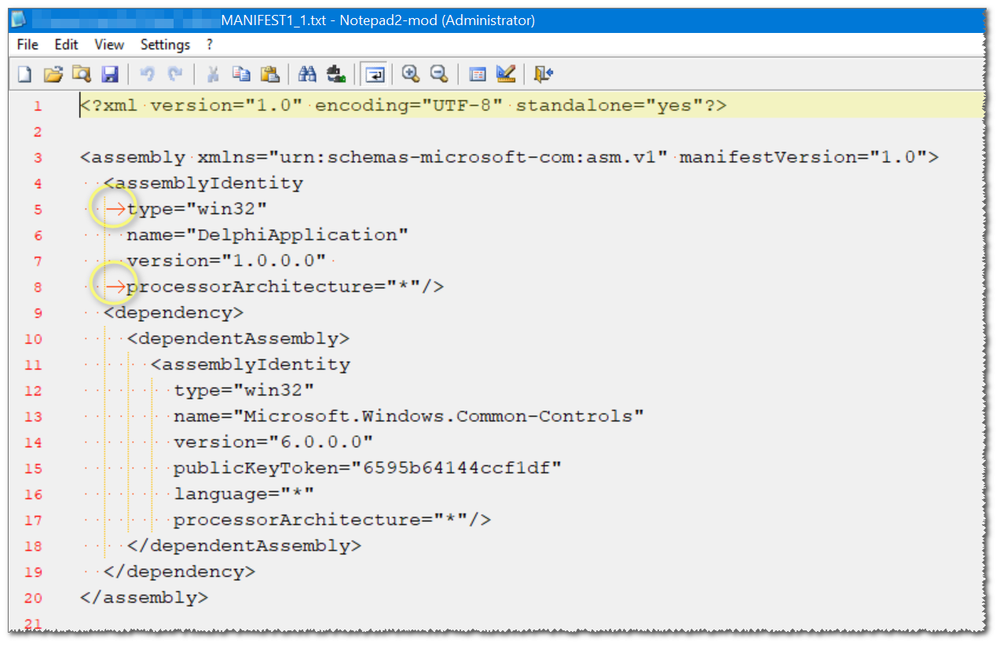

ResourceHacker by Angus Johnson
Version 5.1.8 (360)
Last updated: 20 November 2020

can extracts an exact copy of the embedded manifest resource,  
while `mt.exe` is parsing (and also fixing) it before actually extracting it to file.

for debug purposes,  
it is best to see the manifest as is.  

`mt.exe` will change the layout, remove <kbd>TAB</kbd> and other whitespace,  
and compact the output.

so the actual resource:  

  

will be exported as:  

```xml
<?xml version="1.0" encoding="UTF-8" standalone="yes"?>
<assembly xmlns="urn:schemas-microsoft-com:asm.v1" manifestVersion="1.0">
  <assemblyIdentity type="win32" name="DelphiApplication" version="1.0.0.0" processorArchitecture="*"></assemblyIdentity>
  <dependency>
    <dependentAssembly>
      <assemblyIdentity type="win32" name="Microsoft.Windows.Common-Controls" version="6.0.0.0" publicKeyToken="6595b64144ccf1df" language="*" processorArchitecture="*"></assemblyIdentity>
    </dependentAssembly>
  </dependency>
</assembly>
```

<hr/>

ResourceHacker may export a resource is an already compiled resource (`.res`),  
or as a `.rc` text-file and actual resource(s)-as is, in this case,  
and this version of ResourceHacker,  
the manifest-file file will be exported to `MANIFEST1_1.txt`.  
if there are more resources under the manifest (does not mean anything although possible since it is like any other resource), they will also be save as `MANIFEST1_2.txt`, `MANIFEST1_3.txt`, ...

`ResourceHacker.exe -open input.exe -save .\manifests.rc -action extract -mask 24,, -log .\resourcehacker.log`

ResourceHacker always exist with error-code of `0`, and just (visually) the log will tell if there is any error... :|

the command line support is better but still really crap!  
the `"` character can not be used after the `-mask` command!

but wrapping paths is fine:  

`ResourceHacker.exe -open "input.exe" -save ".\manifests.rc" -action extract -mask 24,, -log ".\resourcehacker.log"`  
